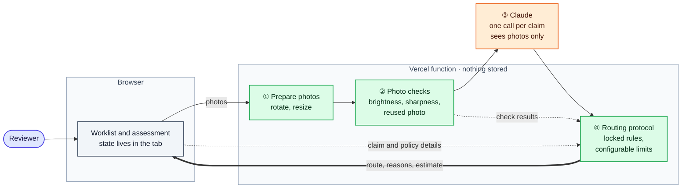

# Vehicle damage claims AI

A customer takes a photo of their damaged car. The AI reads the make, model, color and damage, and gives a rough repair-cost range. Written rules then recommend the next step, and a reviewer makes the call: approve the estimate, ask the customer for better photos, or send the claim to an adjuster.

- Live prototype: https://vehicle-damage-claims-ai.vercel.app
- Evaluation: the **Evaluation** page in the app, and [`eval/README.md`](eval/README.md)

## What you asked for

| You asked for | Where to find it |
|---|---|
| Accept a photo by upload or URL | **+ Add photos**: a photo, a folder per claim, or a link |
| Make, model and color | Top of the assessment card. If it can't tell, it says so instead of guessing |
| Damage summary | Assessment card, e.g. "Left rear door dent with scraping" |
| A rough repair estimate | Assessment card: a likely range, the hours and parts behind it, and possible extras listed separately |
| Setup, architecture, tools, next steps | [Setup](#setup), [Architecture](#architecture-and-data-flow), [Why these tools](#why-these-tools), [Next steps](#what-wed-do-next) |
| Evaluation | [Evaluation](#evaluation) |

## How it works for a claims team

The tool supports the first decision a reviewer makes on a claim. Getting that right means simple claims move faster, customers are asked for the right photos the first time, and serious claims reach an adjuster earlier.

| Route | What happens |
|---|---|
| Ready to approve | The reviewer, a desk appraiser, approves the repair estimate if it's within their approval limit. Payment and booking a repair follow, and the shop can send a supplement if it finds more damage |
| Request more evidence | The reviewer texts or emails the customer which photos to retake, with an upload link. The claim waits until they reply |
| Adjuster / total loss | The claim goes to a field adjuster or the total loss unit, plus the fraud team (SIU) if a photo matches a past claim |

- Approving commits the estimate, as a desk appraiser does today, up to an approval limit (a setting standing in for the reviewer's authority limit). Payment follows the carrier's usual process; nothing is paid automatically.
- If the AI call fails, the claim goes to **manual triage**, which is today's normal process.
- Each claim answers its own question ("Why it's ready to approve", "Why it needs more evidence", "Why it goes to a field adjuster") in one line, such as "Because: car can't be driven (S2) and signs of structural damage (S4)". One click shows each rule in full, what the AI saw, and where each fact came from (the policy, the claim form, the AI, the photo checks), with the policy and photo checks underneath.
- The reviewer can change the amount or the route. Changes go back through the rules, and a route change needs a reason.
- The reviewer can ask a colleague for a second opinion. The claim waits under **Waiting** until they reply, then comes back to the inbox with the reply in the case thread (the demo plays the reply on request). Handing it off ends it on the reviewer's side.
- Each claim has a case thread: the first review, every action, the reviewer's comments, and questions to an assistant that explains the photos but can't change the route. Whoever picks the claim up next sees the whole history.
- Each decision is logged with the recommended route and the reviewer's route, so you can see how often they agree ([more](#tracking-overrides)).

## Setup

The prototype is live at https://vehicle-damage-claims-ai.vercel.app. Click **Load demo queue**, or drag in the `demo-images/` folder (each subfolder is one claim).

To run it locally (Node 22 or later):

```bash
npm install
cp .env.example .env.local     # add ANTHROPIC_API_KEY
npm run dev                    # http://localhost:3000
npm test                       # routing rules and URL safety; no API key needed
npm run eval                   # re-run the labelled set; needs a key and costs money
```

To deploy your own copy, import the repo into Vercel and add `ANTHROPIC_API_KEY`. Optional settings are in `.env.example`.

## Architecture and data flow

### The prototype today



Color key: green is plain code, orange is the AI, purple is people.

1. **Prepare photos.** Fix rotation and resize. Links are downloaded by a safe fetcher first.
2. **Photo checks.** Plain code checks brightness, sharpness, black and white, and whether the photo matches one from a past claim.
3. **AI extraction.** One Claude call per claim. It fills in a fixed form: the vehicle, each damaged part with how bad it is and whether it needs repair or replacement, what the photos show, and any risk signs.
4. **Routing rules.** Written rules pick the route from the AI's answers, the photo checks and the claim details.

**Key design choices**

- **The AI describes, the code decides.** The AI reports facts a reviewer could check in the photo, like whether the badge is visible or the airbags are out. The rules in [`lib/policy/protocol.ts`](lib/policy/protocol.ts) pick the route, and each rule has a test.
- **The AI only sees the photos.** Policy and claim details go to the rules. If the AI were told "the policy says Honda Civic", it would likely lean that way, which would weaken the check that the car matches the policy. It also keeps customer-written text away from the AI.
- **One AI call, not an agent.** The steps are known up front, so letting the model choose them would add time, cost and unpredictability. One call is also easy to measure, retry and fall back from.
- **No confidence scores.** Models aren't reliable judges of their own confidence, so the rules use facts instead. For example, if no badge is visible, the make is left blank.
- **When rules disagree, the more serious route takes priority.** If one rule says adjuster and another says ask for photos, the claim goes to an adjuster.

**The routing rules.** Some are locked, such as injury, structural damage, deployed airbags, a reused photo, or a vehicle that isn't a normal road car. Others are settings the carrier can change within limits, like the $2,500 approval limit and the total-loss line. The total-loss line follows the claim's state, found from its ZIP code: a fixed share of the car's value in some states, a formula (repair plus salvage reaching the car's value) in others, and the carrier's 60% setting where neither applies. **The state rules are from a secondary source and still need checking against each state's law.** Changing a setting re-routes the worklist straight away, because only the rules re-run. **Test against labelled cases** shows what a change would do before it's published: lowering the approval limit to $750, for example, sends all 10 serious test claims to an adjuster, but 3 simple ones too.

The **Routing protocol** page in the app shows all of this on one page: a diagram from the claim and photos, to what the AI describes, to the rules, to the reviewer, with what sends a claim to each route (the open claim's route and the rules it set off are highlighted). Below it are the six rule groups (what each catches, where it sends the claim, whether it's locked), the three settings that matter most, and how prices are set, with a worked example.

**The repair estimate.** The AI describes each repair; an estimating guide (how long each repair takes, and what parts cost) and the carrier's labor rates price it. We found the AI was consistent about *what* was damaged but not about what it cost: the same Civic photo got totals from $750–$1,800 to $1,000–$2,600 across calls. So code turns each described repair into labor and paint hours and a part, then prices them for this car and this place:

- **Where:** the claim's ZIP code picks a labor market that scales the carrier's base rate ($65/h). Maria's Columbus claim is $65/h; the same damage in San Francisco is $81/h, and in Iowa $53/h.
- **What car:** parts cost more on a luxury make or a car worth over $40,000, and less on one worth under $10,000. Electric and hybrid cars add a high-voltage safety step.

The same photo now prices at $950 to $1,300 (Columbus) on every call.

- **Under each estimate, three short lines show where its inputs came from:** *From the photos* (the AI's reading: each damaged part, how badly, repair or replace), *From the claim* (the ZIP and its labor market, the car on the policy and its value, which set the parts level), and *From the estimating guide* (labor hours per repair, at the carrier's labor and paint rates). The AI only supplies the first.
- **Each line shows its working:** what the AI saw in the photo, the hours and rates ("4.5 h body x $65 + 3.5 h paint x $110 = $678"), and the repair cost against the replacement cost, with the one priced marked. If repairing a part would cost more than replacing it, it's priced as a replacement.
- **The range covers what the photos show,** 15% either side of the most likely cost (a setting).
- **What the photos can't show is listed separately** as possible extras: damage behind the panels, parts the AI flagged for inspection, sensor recalibration. The routing rules use the figure with them included, so a claim isn't approved on the assumption that nothing else turns up.
- **The AI's own price is kept as a cross-check,** and used for parts the estimating guide doesn't cover and for vehicles that aren't road cars.
- **Every hour, rate and market is a placeholder.** In production:
    - **Third-party data** gives the hours and parts: an estimating platform's labor times (CCC, Mitchell or Audatex), and parts priced for the exact car from its VIN.
    - **The carrier's data** gives the rates: labor rates by market and the deals with its partner shops.
    - **Historical paid claims** calibrate it: compare our estimates with what was finally paid, by region, vehicle and damage type, correct where we're consistently off, and set the range width so an agreed share of final costs land inside it.
    - **For total loss,** the car's value would come from a valuation provider, salvage values from salvage auction data, and the state rules from the carrier's compliance team. Past total-loss decisions show where the line sits in practice.

  The protocol owner can change the base rates in the app, and **Edit details** can change a claim's ZIP to see the price move.

When a claim can't be priced reliably yet, the range is marked **Provisional** and doesn't affect the route.

### In production

The same steps, inside the carrier's own cloud account and connected to their claims system. Claude runs on AWS (Bedrock) and Google Cloud (Vertex AI), so photos can stay in the carrier's account.


Color key: green is plain code, orange is the AI, blue is stored data, purple is people.

| Prototype | Production |
|---|---|
| Worklist lives in the browser | Connected to the claims system (for example Guidewire), with decisions written back to the claim file |
| No image storage | Photos in the carrier's storage, with retention rules |
| One request per claim | A queue with retries and rate limits, so a spike in claims doesn't cause timeouts |
| Decision record you can download | An audit log of every decision, with monitoring on speed, cost, failures and overrides |
| Versions shown on each result | Each prompt, model or rule change tested against the labelled set before release |
| Mock roles | Single sign-on, role-based access, two-person approval for rule changes |
| Checks against one demo past-claim photo | Duplicate search across all past photos, plus a check for edited images |
| A placeholder estimating guide | Labor times from an estimating platform, the carrier's own rates, and calibration on its paid claims |
| A person approves each claim | Gradual automation for narrow, low-risk cases (see [Path to production](#path-to-production)) |

## Why these tools

| Option | Good at | Why we didn't start there |
|---|---|---|
| **Claude (what we used)** | Reads photos well, fills in a fixed format reliably, runs on AWS and Google Cloud | Still needs testing on your claims |
| GPT or Gemini | Similar capability | Not tested here. Switching would be a settings change plus a test run |
| Estimating vendors (Tractable, CCC, Mitchell) | Pricing, based on large volumes of paid claims | Their reasoning isn't visible. Our routing could use their price in production |
| A custom vision model | Locating damage, at low cost per photo | Needs many labelled photos and an ML team, and doesn't give make, model or price |
| Open-source models | Photos stay in your environment | Generally less accurate today, and more to run |

Because the output format is fixed and the labelled set checks the results, the model can be swapped without changing the rules or the screen.

- **Vercel, Next.js and TypeScript** gave us a working link quickly, with the screen and server in one codebase, so the rules shown on screen are the same code the server runs. A carrier would run the same code in their own cloud.
- **Anthropic's SDK** makes the one Claude call per claim, with structured outputs.
- **sharp** handles image prep and photo checks, **zod** validates requests and the AI's answer, and Node's test runner runs the rule tests.

## Speed and cost

Measured on the 26 labelled cases, end to end:

| | Opus 5.5 (default) | Sonnet 5.5 |
|---|---|---|
| Typical time per claim | 9.7 s | 7.0 s |
| Slowest 1 in 10 | 13.0 s | 8.9 s |
| Estimated cost per claim | $0.039 | $0.019 |
| Failed calls | 0 of 26 | 0 of 26 |

- Most of the time is the AI call. Claims are assessed in the background, three at a time, so a reviewer doesn't usually wait.
- The call times out at 45 seconds, retries once, then goes to manual triage.
- At about 4 cents a claim, 100,000 claims a year is roughly $4,000 at list prices. Our actual bill was higher than these estimates, so treat them as a lower bound. Integration and expert labelling cost more than the model.

## Evaluation

**The short answer.** On 26 test claims, it sent all 10 serious claims to an adjuster and none of the 16 simple ones. When it was unsure, it asked for another photo rather than guess. That's a good start, not proof: proof needs the carrier's own claims. The [evaluation page](https://vehicle-damage-claims-ai.vercel.app/evaluation) shows the same results, with every test claim and its photo.

| | |
|---|---|
| Serious claims that went to an adjuster | 10 of 10 (with so few, the real rate could be as low as 72%) |
| Simple claims sent to an adjuster they didn't need | 0 of 16 |
| Same route as our expert | 23 of 26 |
| Time and cost | About 10 seconds and 4 cents a claim |

### What we tested it on

- **Are they real claims?** No. The photos are real photos of damaged cars, but the claim details (the customer, the policy, the car's value) are made up for testing. None come from an insurer.
- **Where are the photos from?** 8 originals: four real crashes from Wikimedia Commons (a flood, a front-end crush, a van under a wall, a car into a tree; licenses still to confirm), a press photo of a race-car crash, a dented Honda Civic and Toyota Camry, and one photo with no car in it.
- **Why 26?** The other 18 are built from those 8 to test one thing each. 13 are harder versions of a photo (too dark, blurry, compressed, sideways, glare, mirrored, close-ups): does it ask for a better photo instead of guessing? 5 reuse the Civic photo with a tricky claim detail (an injury, damage on the wrong side, a low-value car, two different cars, already asked twice): do the rules catch it?
- **Who decided the right answer?** I did, as drafts. An estimator should review them before anyone relies on these numbers.
- **Did any answers change after testing?** One. A test claim reuses the Civic photo on a car worth only $2,500, and I'd first labelled it a total loss. The repair is about $1,130, 45% of the car's value and under the 60% total-loss line, so an estimator would repair it. I corrected the label, and sending it to an adjuster still counts as reasonable. With the carrier's claims, their estimators set the answers before testing.
- **The gap.** Only 7 cases should be approved from photos, because the set was built to cover the rules. More ordinary, simple claims are the next thing to add. [`eval/README.md`](eval/README.md) lists them.

### How would we know it's working?

Mistakes don't cost the same here, so we don't lead with overall accuracy. We read two numbers together:

1. **Serious claims that went to an adjuster.** If an expert would send a claim to an adjuster, we should too. Missing one, like a likely total loss handled as a simple repair, is costly to fix later.
2. **Simple claims sent to an adjuster they didn't need.** Sending everything to an adjuster would make the first number perfect, but then the tool wouldn't save the team any work.

We also check the basics: the right make, model and colour, or left blank when it can't tell (it didn't guess on 17 of 17), and how consistent, fast and cheap it is. Once it's live, reviewers' corrections (the **Completed** tab) keep measuring the same things, and each one can be downloaded as a new test case. The carrier decides what counts as good enough.

### Where does it fail?

The 3 claims it didn't get exactly right, most serious first. None was a serious claim approved from photos.

1. **A clean photo, uploaded sideways.** It asked for another photo; the expert would have approved. Sideways, the AI couldn't tell which car it was. Straightening photos before the AI sees them would fix it. Today it costs the customer one extra photo, and it never lets a serious claim through.
2. **Front-corner damage priced close to the $2,500 limit.** Over four runs it was approved three times and sent to an adjuster once. Claims whose price could run well past the limit now always go to an adjuster, so it gives the same answer every time.
3. **A blurry, forwarded copy of a photo.** It asked for a better photo; the expert might have approved from it. Asking is reasonable, and reviewers' decisions would tell us if it asks too often.

The mistakes we'd watch most closely on live claims:

- A serious claim approved from photos when it needed an adjuster. The locked rules are there to stop this.
- A price on the wrong side of the $2,500 approval limit.
- Edited photos. We catch reused photos, but not edited ones yet.

### What would we need from the carrier?

- **A few hundred past claims:** the photos, where each claim went, what was finally paid, and any supplements.
- **Two of their estimators** labelling them separately. How often they agree with each other is the bar to beat.
- **Today's numbers:** how often claims are escalated late, how often shops file supplements, and how long a review takes.
- **A test set nobody tunes on,** so every prompt, model or rule change is checked against it before it goes live.
- **Their own rules:** limits, labor rates and vehicle values, plus security and compliance input on where photos can be processed and how long they're kept.

Scale can do the expert labelling.

### Is the repair estimate good enough?

We can't tell yet. That needs their paid claims, and the app says so on every estimate. Once we have them, we'd check how often the final paid amount falls inside our range, and how wide the range is. A very wide range will usually contain the paid amount but isn't much help, so we keep the range to what the photos show and list the possible extras separately. The range width is a setting we'd calibrate on their paid claims.

What matters most is which side of the $2,500 approval limit the estimate lands on. If it's close, the claim is flagged for a price check. If it could run well over, it goes to an adjuster. If an approved estimate turns out too low, the body shop files a supplement, the same as today, and it's reviewed.

### Results in detail

| | Opus 5.5, prompt v1 | Opus 5.5, prompt v2 | Sonnet 5.5, prompt v2 |
|---|---|---|---|
| Serious claims that went to an adjuster | 10 of 10 | 10 of 10 | 10 of 10 |
| Same route as our expert (or one the label also accepts) | 22 (23) of 26 | 23 (25) of 26 | 23 (25) of 26 |
| Simple claims sent to an adjuster they didn't need | 1 of 16 | 0 of 16 | 0 of 16 |
| Didn't guess when it couldn't tell | 17 of 17 | 17 of 17 | 16 of 17 |
| Same route on all 4 runs | not measured | 25 of 26 (with AI pricing) | not measured |

- **Prompt v1 to v2.** After the first run we changed four instructions based on the cases it got wrong. For example, a crumpled bumper no longer counts as "structural" damage. Since v2 was written after seeing these same cases, its improvement probably looks better here than it would on new ones.
- **Opus or Sonnet.** They routed the same here, and Sonnet is faster and half the price. 26 cases aren't enough to tell them apart; the carrier's own claims should decide.
- All three columns are scored with today's rules and estimating guide, from the saved AI answers, so re-scoring costs nothing.

### Failure modes

| Failure | How likely | What the prototype does |
|---|---|---|
| Serious claim approved from photos | Low, but high impact | Locked safety rules, the more serious route takes priority, measured in the evaluation |
| Wrong vehicle named with confidence | Medium | Make and model left blank without a badge or distinctive shape; policy mismatch flagged |
| Damage missed or made up | Medium | "No damage visible" asks for photos; the reviewer approves each estimate |
| Estimate on the wrong side of a limit | Likely near the limit | Ranges close to the limit are flagged, very wide ones go to an adjuster |
| AI error or timeout | Occasional | One retry, then manual triage |
| Reused or edited photo | Becoming more common | Reused photos are caught and sent to SIU; edited photos aren't detected yet |
| Instructions written into a photo | Rare | The AI doesn't pick the route, so the likely worst case is a wrong fact the reviewer can see |

## Path to production

A person approves each claim today. That's the right place to start. We'd reduce review gradually, one narrow, low-risk slice at a time, with evidence first and checks still running afterwards.

| Stage | The AI | People | To move on |
|---|---|---|---|
| 1. Live comparison | Recommends routes in the background; nobody acts on them | Work claims as today | Its routes compared with adjusters' decisions for 4 to 6 weeks |
| 2. Limited pilot (this prototype) | Recommends a route for one claim segment | Approve every route | Agreed results on the carrier's own claims |
| 3. One automatic slice | Sends photo requests, later small photo estimates, without a reviewer | Review a random sample and anything flagged | Sampled reviews keep agreeing; supplements and complaints don't rise |
| 4. Expand | One more segment at a time | Sample and monitor | Each segment passes the same checks |

**What stays with a person:** total loss, injury, fraud referrals, denials, reduced payments, and anything the tool couldn't assess. The rules already work this way, and it matches where regulation is heading (the NAIC's 2023 model bulletin on insurers' use of AI expects controls in proportion to the potential harm).

**How we'd know a slice is ready,** agreed with the claims and risk owners up front:

- Serious claims that go to an adjuster, judged by the low end of the likely range. Showing a miss rate under 1% takes around 300 serious claims without a miss.
- Route agreement at least as good as two experts get with each other.
- Estimate ranges that contain the final paid cost at an agreed rate, and no rise in supplements.
- Reviewer overrides low and trending down.

### Tracking overrides

How often reviewers disagree with the recommendation is a direct way to measure accuracy on live claims. Each decision records the recommended route and team, the reviewer's route and who they sent it to, the estimate and any amount the reviewer changed it to, the reason, and the rules that fired. In the prototype, **Completed** shows "Kept the recommendation on X of Y decisions", with route changes, amount changes and hand-offs to a different team counted separately (sending a total loss to a field adjuster on the right route still counts as a different decision), and the log downloads as a CSV. Each claim's **Decision record** shows everything behind it, and any correction can be downloaded as a labelled test case for the evaluation set. In production it would feed an override dashboard, and each correction would become a bug fix or a new test case.

## Key assumptions and trade-offs

- **It doesn't store anything.** The worklist lives in your browser tab and photos are only held in memory. That keeps the privacy answer simple, but there's no history.
- **One demo photo is AI-generated.** The Brooklyn RAV4 (demo claim F) is a generated image; every other demo and test photo is a real photo.
- **The claim details and dollar limits are made up.** The $2,500 approval limit, the labor markets, the state total-loss rules and the cost adjustments are placeholders for the carrier's numbers. The approval limit stands in for a reviewer's authority limit; carriers set these by role, and photo estimating is usually kept to small, drivable, no-injury claims, so $2,500 sits in a realistic range.
- **The photo checks are rough.** They were tuned on a handful of images, and the reused-photo check catches a mirrored copy but not a rotated one.
- **Some inputs are turned away.** JPEG, PNG and WebP only, up to eight photos a claim. HEIC and video get a message saying what to send instead.
- **Links are treated as untrusted.** The server only follows https links to public addresses and only accepts real image files.

## What we'd do next

1. Run the evaluation on the carrier's past claims, with expert labels, and test the estimate against what was actually paid.
2. Replace the placeholder estimating guide with an estimating platform's labor times and the carrier's own rates, and calibrate the range width on paid claims.
3. Straighten photos in code, accept video and HEIC, and add a check for edited photos.

## Repository layout

```
app/                  Pages and API routes
components/           Worklist, assessment panel, photo viewer, intake
demo-images/          Demo claims, one folder per claim
eval/                 Labelled cases, test images, saved results
lib/extraction/       The Claude call, prompt and output format
lib/policy/           Routing rules, estimate and rule engine, with tests
lib/image/            Photo checks
lib/net/              Safe link fetching, with tests
lib/eval/             Evaluation runner and scoring
lib/client/           Browser-side worklist, customer contact and review log
```
